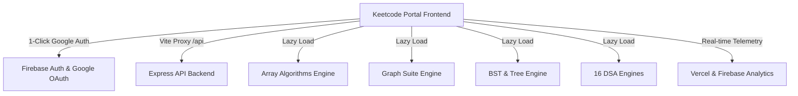

# Keetcode® | Algorithmic Intelligence & DSA Visualizer Suite

[](https://react.dev/)
[](https://vitejs.dev/)
[](https://www.typescriptlang.org/)
[](https://tailwindcss.com/)
[](https://firebase.google.com/)
[](LICENSE)

> **Keetcode®** is an interactive, zero-distraction Data Structures and Algorithms visualizer portal built for deep thinkers, competitive programmers, and software engineers. Designed with a dark glassmorphic UI, cinematic typography, and real-time execution step tracing.

---

## 🌟 Vision & Motivation

### Built by **Vikash** (Founder & Lead Architect, B.Tech)

Data Structures and Algorithms are frequently taught through static diagrams and textbook equations. **Keetcode®** was conceived to solve this fundamental gap by providing interactive, step-by-step state engines for 16 major DSA domains.

Whether analyzing complex graph pathfinding (Dijkstra/Kruskal), tree balancing (BST/AVL), string pattern matching (KMP/Z-Algorithm), or recursive backtracking state trees (N-Queens/Sudoku), Keetcode transforms abstract code into intuitive visual physics.

---

## 🏗️ Architecture & System Design

Keetcode® uses a modular architecture combining high-performance React 19 visualizer engines, Vite bundling, and Firebase Authentication:



### Key Technical Highlights:
- **Modular Lazy Loading**: All 16 DSA visualizers are decoupled into standalone sub-applications dynamically loaded via `React.lazy()` for optimal performance.
- **Glassmorphic UI System**: Custom CSS `.liquid-glass` engine built with luminosity blending, backdrop-filters, and Google Playfair Display & Inter typography.
- **1-Click Firebase Google OAuth**: Integrated `signInWithPopup` authentication with state persistence.
- **Express Backend API**: Lightweight Node.js authentication server with persistent JSON storage.

---

## 🚀 16 Interactive Algorithm Engines

| # | Visualizer Suite | Key Algorithms & Topics Included | Difficulty |
|---|---|---|---|
| 1 | **Array Algorithms Engine** | Kadane's Algorithm, Prefix Sums, Dutch National Flag, Array Rotations | Beginner |
| 2 | **Binary Search & Answer Space** | Lower/Upper Bound, Search in Rotated Array, Answer Space (Aggressive Cows) | Intermediate |
| 3 | **Binary Search Tree (BST)** | BST Insert/Delete, Inorder/Preorder/Postorder, Floor/Ceil, AVL Balance | Intermediate |
| 4 | **Binary Tree Algorithms** | BFS Level Order, Max Path Sum, Tree Diameter, Left/Right Views | Intermediate |
| 5 | **Bitwise & Interval Engine** | Bit Shifts, XOR Tricks, Merge Intervals, Insert Interval | Intermediate |
| 6 | **Fast & Slow Pointers** | Floyd's Cycle Detection, Find Middle Node, Happy Number | Beginner |
| 7 | **Graph Algorithms Suite** | BFS, DFS, Dijkstra's Shortest Path, Kahn's Topological Sort, Kruskal's MST | Advanced |
| 8 | **Heap & Priority Queue** | Min/Max Heapify, Heap Sort, Top K Frequent Elements, Running Median | Intermediate |
| 9 | **Linked List Pointer Engine** | Singly & Doubly Lists, Reverse List, Merge Sorted Lists, K-Group Reverse | Beginner |
| 10 | **Math & Prefix Sum Engine** | Sieve of Eratosthenes, Euclidean GCD, 2D Matrix Prefix Sum, Difference Array | Beginner |
| 11 | **Queue & Deque Engine** | Circular Queue, Monotonic Deque, Sliding Window Maximum | Beginner |
| 12 | **Recursion & Backtracking** | N-Queens Puzzle, Sudoku Solver, Subsets & Permutations, Maze Pathfinding | Advanced |
| 13 | **Sliding Window Visualizer** | Fixed Window Sum, Longest Substring Without Repeats, Min Window Substring | Intermediate |
| 14 | **Stack & Expression Engine** | Monotonic Stack (Next Greater Element), Infix to Postfix, RPN Evaluator | Intermediate |
| 15 | **String & Pattern Matching** | KMP Algorithm (LPS Array), Rabin-Karp Hashing, Z-Algorithm, Trie Autocomplete | Advanced |
| 16 | **Two Pointers & Kadane's** | Two Sum, 3Sum, Trapping Rain Water, Container With Most Water, Kadane's | Beginner |

---

## 🛠️ Local Development & Setup

### Prerequisites
- **Node.js**: v18.0.0 or higher
- **npm**: v9.0.0 or higher

### Installation Steps

1. **Clone the repository**:
   ```bash
   git clone https://github.com/vikashkumar302004/keetcode-visualiser.git
   cd keetcode-visualiser
   ```

2. **Install dependencies**:
   ```bash
   npm install
   ```

3. **Start the Frontend Development Server**:
   ```bash
   npm run dev
   ```
   *The application will launch on `http://localhost:3000/`.*

4. **Start the Express Backend API (Optional)**:
   ```bash
   npm run server
   ```
   *The backend API will run on `http://localhost:5000/`.*

---

## 📄 License

Distributed under the **MIT License**. See `LICENSE` for more information.

---

<p align="center">
  Crafted with ❤️ by <b>Vikash</b> (B.Tech)
</p>
